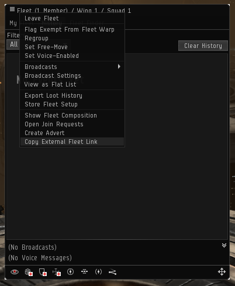

# Authentication 
## Getting the API key
Go to your Globaldots customer account....

## Using your API key
Use the API key in a custom http header `x-api-key`
For example, 

`curl -H "x-api-key: xyzaaaaaaa`
