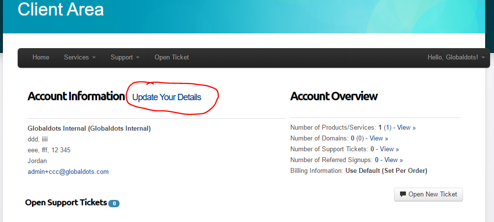
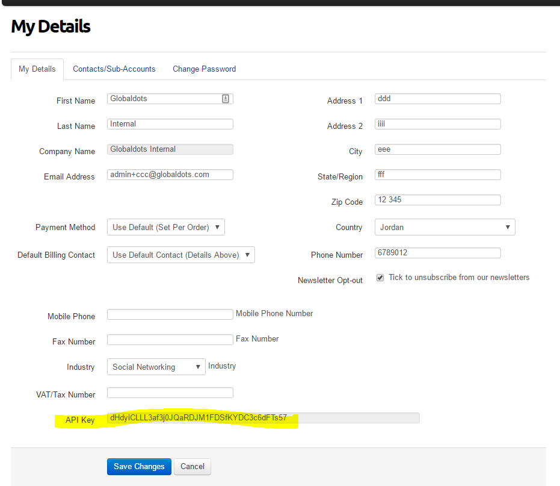

# Authentication 
## Getting the API key
Log into your Globaldots customer account.

Click the account details. If you were issued an API key, you will see it at the bottom of the details.  

## Issuing a new API key
If you don't have an API key, or if you need to replace it, please open a support ticket. 

## Using your API key
Use the API key in a custom http header `x-api-key`
For example, 

`curl -H "x-api-key: xyzaaaaaaa`
